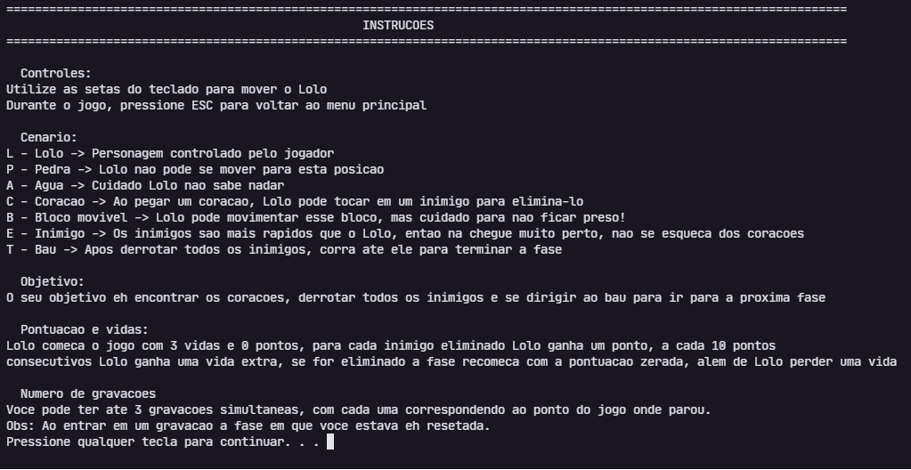
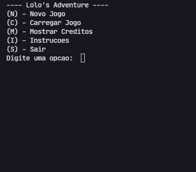

# 🎮 Jogo Lolo's Adventure

<h1 align="center">
    
</h1>

  <a href="#-tecnologias">Tecnologias</a>&nbsp;&nbsp;&nbsp;|&nbsp;&nbsp;&nbsp;
  <a href="#-bibliotecas">Bibliotecas</a>&nbsp;&nbsp;&nbsp;|&nbsp;&nbsp;&nbsp;
  <a href="#%EF%B8%8F-desenvolvedores">Desenvolvedores</a>&nbsp;&nbsp;&nbsp;|&nbsp;&nbsp;&nbsp;
  <a href="#-licença">Licença</a>

  

Implementação do Jogo Lolo's Adventure em C, em formato texto (ASCII art)

    
    

## 🚀 Tecnologias

Esse projeto foi desenvolvido com a seguinte tecnologia:

- C

## 📚 Bibliotecas

- stdio.h
- stdlib.h
- ctype.h
- string.h
- conio.h
- conio2.h
- string.h
- time.h
- windows.h

## ⌨️ Desenvolvedores

### [Arthur Henrique Wiebusch](https://github.com/ArthurHW) 
### [Vitor Caruso Rodrigues Ferrer](https://github.com/CarusoVitor)

## 📝 Licença

Esse projeto está sob a licença MIT. Veja o arquivo [LICENSE](LICENSE.md) para mais detalhes.
